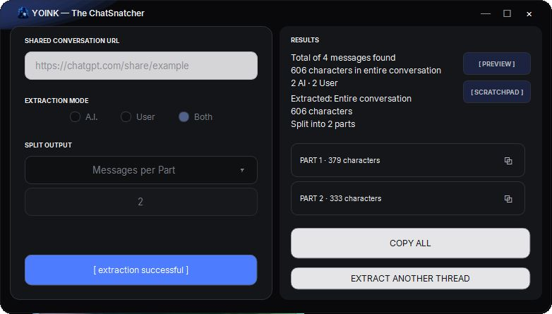
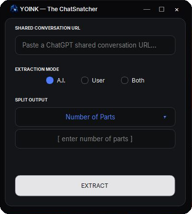
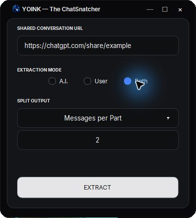
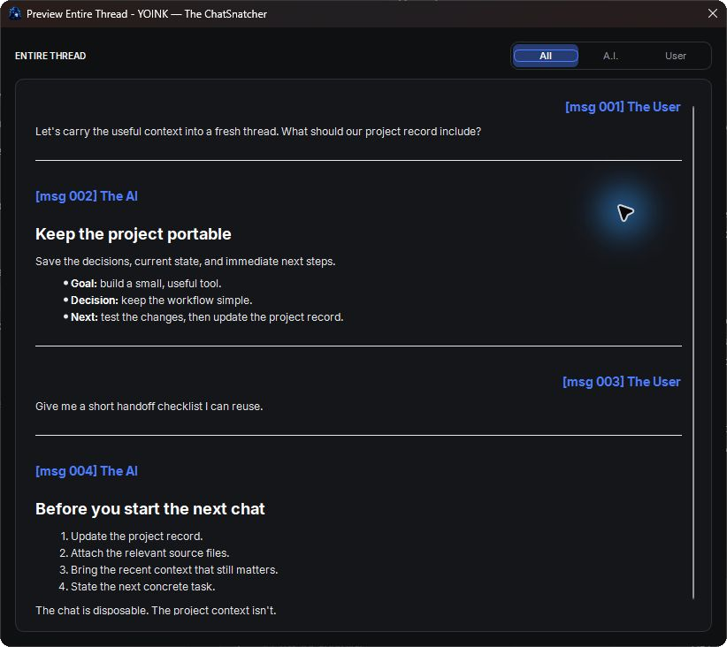
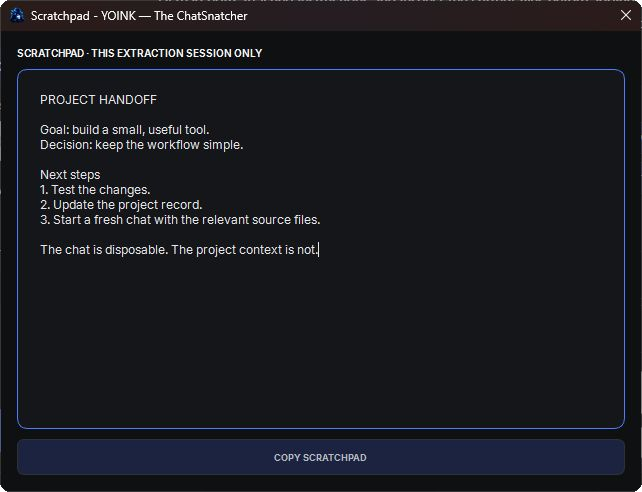

<p align="center">
  
</p>

<h1 align="center">YOINK — The ChatSnatcher</h1>
<p align="center"><strong>Your Oversized Interactions, Nicely Kept.</strong></p>

<p align="center">
  
  <a href="LICENSE"></a>
  
</p>

<p align="center">
  <a href="https://github.com/kennclark-yb/YOINK/releases">Download for Windows</a> ·
  <a href="#how-to-use-it">How to use it</a> ·
  <a href="BUILDING.md">Build from source</a> ·
  <a href="CONTRIBUTING.md">Contribute</a>
</p>

YOINK yoinks messages from shared ChatGPT conversations and turns them
into clean, split, copyable text.

Because apparently manually Ctrl+C'ing your way through a conversation
the size of a Victorian novel is not a workflow.

<p align="center">
  
</p>

*The real app, shown with a made-up conversation. No private chats were yoinked for these screenshots.*

------------------------------------------------------------------------

## Want a free unlimited context window for ChatGPT?

**TOO BAD. YOU'RE POOR.\***

That's why I made YOINK.

\* **YOINK does not actually give ChatGPT an unlimited context window.**
If I could do that, this README would be significantly shorter.

What it *can* do is make your context **portable**.

Long-running ChatGPT threads eventually become awkward places to live.
They get enormous. Finding things becomes archaeology. Depending on your
plan and workflow, you may also run into context limits, upload limits,
or simply reach the point where continuing one gigantic conversation is
less useful than starting fresh.

But starting fresh has its own problem:

> "Cool. Now how do I bring the important stuff with me?"

**YOINK it.**

Extract the conversation, split it into manageable pieces, carry forward
what matters, and start the next chat with useful context instead of
performing a séance for your previous thread.

**The chat is disposable. The project context isn't.**

------------------------------------------------------------------------

## The workflow that created this thing

YOINK originally came from a simple project workflow:

``` text
Brainstorm
    ↓
Establish a Project Record
    ↓
Work in ChatGPT
    ↓
Thread becomes an absolute unit
    ↓
YOINK the conversation
    ↓
Update the Project Record
    ↓
Start a fresh chat
    ↓
Project Record + relevant source files + recent context
    ↓
KEEP GOING
```

Instead of treating one ChatGPT thread like a sacred artifact that must
survive until the heat death of the universe, keep the **project state**
portable.

For development work, that might mean carrying forward a current
project/status Markdown file, relevant source files, recent conversation
context, decisions already made, and immediate next steps.

Rinse. Repeat. Continue building.

------------------------------------------------------------------------

## Who is this for?

### The Free-Tier Peasant

Want a free unlimited context window?

**TOO BAD. YOU'RE POOR.**

Welcome. So am I.

YOINK came from wanting a workflow that lets you squeeze as much useful
work as possible out of ChatGPT without treating one increasingly
gigantic thread like the last helicopter out of Saigon.

Brainstorm. Establish a project record. Work for a while. When the
thread gets huge or the useful context starts getting shaky, YOINK what
matters, update the record, start a fresh chat, attach the record and
relevant files, and keep going.

Starting a new chat doesn't have to mean starting the project over.

### The Paying Citizen

Not rich enough for Codex or a magical workspace with credits falling
from the ceiling?

**Boo hoo. Congratulations on your longer context window and file
uploads.**

Eventually, sufficiently enormous threads can still become cumbersome,
laggy, inconsistent, or just deeply unpleasant to navigate.

The same workflow works wonders: YOINK the useful context, carry the
project state forward, and start fresh without performing a 400-message
archaeological expedition.

### The Ultra Pro Max Workspace Aristocrat

You have Codex? Giant context? Workspaces? Greater credits?

**Well good on you.**

What are you doing here?

YOINK can still be useful for archiving, handoffs, extracting selected
context, or moving conversations between tools.

If it somehow still saves you time, buy me a coffee someday.

------------------------------------------------------------------------

## What YOINK yoinks

Give YOINK a supported shared ChatGPT URL and choose what you want:

-   **A.I.** --- extract assistant messages only.
-   **User** --- extract your messages only.
-   **Both** --- take the whole conversation.

YOINK produces **Markdown-formatted text** with clean message headings,
numbering, role labels, and separators.

Then split it by:

-   **Character Limit** --- useful when you're working around
    input/context sizes.
-   **Number of Parts** --- tell YOINK how many chunks you want and let
    it balance them. This is the default; enter the number you want.
-   **Messages per Part** --- set the maximum number of intact messages in
    each chunk. Ten messages at three per part gives you 3, 3, 3, and 1.

You can preview the entire extracted thread, copy individual parts, or
**Copy All**.

No 400-message archaeological expedition required.

------------------------------------------------------------------------

## Features

-   Extract **A.I., User, or Both** sides of a shared ChatGPT
    conversation.
-   Split output by **Character Limit**, **Number of Parts**, or **Messages per Part**.
-   Preserve message order and keep individual messages intact while
    splitting.
-   Preview the entire extracted conversation before copying.
-   Filter Preview with **All / A.I. / User**, independently of your output mode.
-   Copy individual parts with one click.
-   Copy all generated parts at once.
-   Collect selected context in a separate **Scratchpad** window and copy it
    together. Notes last for the current extraction session only.
-   Markdown-formatted output suitable for pasting into chats, notes,
    project records, or other tools.
-   Clear progress and retry states.
-   Reset and immediately YOINK another thread.
-   Portable Windows build.
-   Bundled browser runtime --- no separate Chromium installation
    required.
-   No Python installation required when using the packaged release.
-   Quiet startup update checks, with **Ctrl+U** for a manual check.
    You choose when to visit the release page; nothing downloads or installs itself.

And yes, the loading messages are stupid on purpose.

------------------------------------------------------------------------

## Download

Go to **[Releases](https://github.com/kennclark-yb/YOINK/releases)** and
download the latest Windows ZIP.

YOINK v1 is distributed as a portable Windows folder.

1.  Download the release ZIP.
2.  Extract the **entire** folder somewhere permanent.
3.  Run `YOINK.exe`.
4.  Optional but recommended: right-click `YOINK.exe` → **Show more
    options** → **Send to** → **Desktop (create shortcut)**.
5.  Feed the little bastard a shared ChatGPT link.

**Do not pull `YOINK.exe` out by itself.** It needs the files shipped
alongside it. If you want YOINK on your Desktop, create a shortcut
instead of moving the executable out of its folder.

No installer is required.

### Windows may complain

YOINK v1 is currently **unsigned**, so Windows may display a
security/reputation warning for an unfamiliar executable.

The source code and build configuration are available in this repository
if you'd rather inspect or build it yourself.

------------------------------------------------------------------------

## How to use it

1.  In ChatGPT, create/copy a **shared conversation link**.
2.  Paste that link into YOINK.
3.  Choose **A.I.**, **User**, or **Both**.
4.  Choose how the output should be split.
5.  Hit **Extract**.
6.  Preview it, copy individual parts, or **Copy All**.
7.  YOINK achieved.

### 1. Feed it a link

Open YOINK, paste your shared link, and pick the messages and split size you want.
**Number of Parts** starts selected with an empty value. Enter a positive whole
number, or choose another mode. **Messages per Part** also needs a positive whole
number; **Character Limit** uses 9000 if left empty. Missing or invalid input gets
an inline explanation and a small nudge on the field that needs attention.

<p align="center">
  
  
</p>

### 2. Inspect the haul

Results shows the message counts and your split parts. **Preview** opens
**Preview Entire Thread**, so you can read the full conversation before copying.
It always opens on **All**, including both roles even if your output contains
only A.I. or User messages. The sliding **All / A.I. / User** selector changes
only the Preview display, keeping the original message numbers. Accent headers
sit left for A.I. and right for User; message bodies stay normally aligned.
Use the copy icon beside a part, or **Copy All** to take the lot.

<p align="center">
  
</p>

### 3. Keep the useful bits

Open **Scratchpad** beside Preview. Type or paste selected context into its
separate window, then hit **Copy Scratchpad**.

Closing and reopening the Scratchpad keeps your notes during the same extraction
session. **Extract Another Thread** clears them. Closing YOINK clears them too.
Nothing in the scratchpad is saved to disk. Copy anything you want to keep first.

<p align="center">
  
</p>

### Staying current

YOINK quietly checks the official GitHub repository's latest release at startup.
A newer version gets a small **View Release / Later** prompt. Otherwise, silence.
Press **Ctrl+U** to check yourself: YOINK tells you whether you're up to date,
there's a newer release, or the check couldn't complete.

Updates are yours to download and unpack. No automatic downloads or installations.

------------------------------------------------------------------------

## Current limitations

YOINK v1 currently supports **ChatGPT shared conversation URLs
(`chatgpt.com/share/...`)**.

It does **not** currently support regular/private ChatGPT conversation
URLs, Codex shared URLs, Claude, Gemini, or every AI website mankind has
managed to produce this week.

Internet access is required for extraction.

YOINK depends on the structure and availability of ChatGPT's shared
conversation pages. If OpenAI substantially changes how those pages
work, extraction may require an update.

The packaged Windows build is currently large because it includes its
own browser runtime. Size optimization is on the table for a future
build; v1 prioritizes a self-contained, known-good package.

The fat bastard brought luggage.

------------------------------------------------------------------------

## Building from source

YOINK currently targets Windows.

Requirements and build dependencies are pinned in `requirements.txt` and
`requirements-build.txt`.

For the packaged Windows build:

``` powershell
.\build_windows.ps1
```

See [`BUILDING.md`](BUILDING.md) for the full build and packaging
instructions.

------------------------------------------------------------------------

## Testing

YOINK includes automated tests under [`tests/`](tests/).

If you're changing extraction, formatting, GUI behavior, or packaging,
run the relevant tests before opening a pull request.

The v1 Windows release was also manually smoke-tested against real
shared ChatGPT conversations, including extraction, Preview, per-part
copying, Copy All, reset/re-extraction, window interaction, and shutdown
behavior.

------------------------------------------------------------------------

## Coming next

YOINK v1.0.0 is the baseline release.

The **Results Scratchpad**, **GitHub update checker**, and **Messages per Part**
are now included.

Things still on the post-v1 menu:

-   **Caveman Mode** --- a future local-LLM-assisted workflow for
    beating oversized project conversations into useful project
    records/handoffs.
-   Additional platform support, including **Claude** and **Gemini**,
    later.

No dates. No blood oaths. They'll arrive when they stop being ideas and
start passing tests.

------------------------------------------------------------------------

## Contributing

Bug reports, ideas, fixes, and improvements are welcome.

If you're changing code, please read
[`CONTRIBUTING.md`](CONTRIBUTING.md) first.

The short version:

> Keep changes focused.\
> Test your work.\
> Don't break the ChatSnatcher.

------------------------------------------------------------------------

## License

YOINK is released under the **MIT License**.

Copyright (c) 2026 autowolf

See [`LICENSE`](LICENSE).

------------------------------------------------------------------------

## Why "YOINK"?

Because "Structured Conversation Context Extraction and Portability
Utility" sounded like software you would be forced to use at work.

**YOINK** stands for:

**Your Oversized Interactions, Nicely Kept.**

And YOINK yoinks.

That's the product specification.
